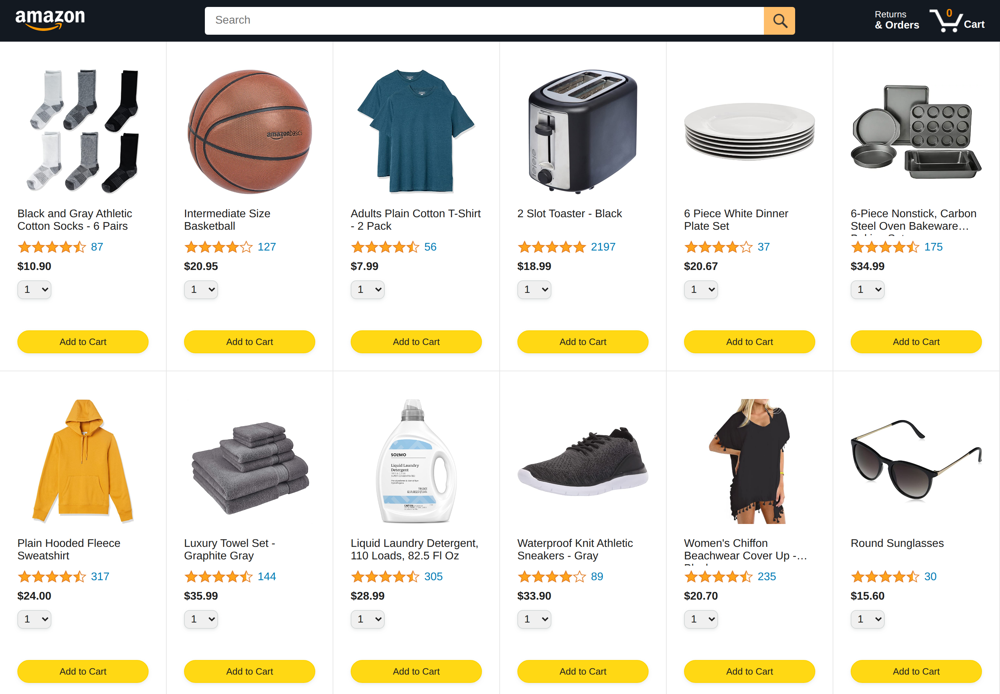
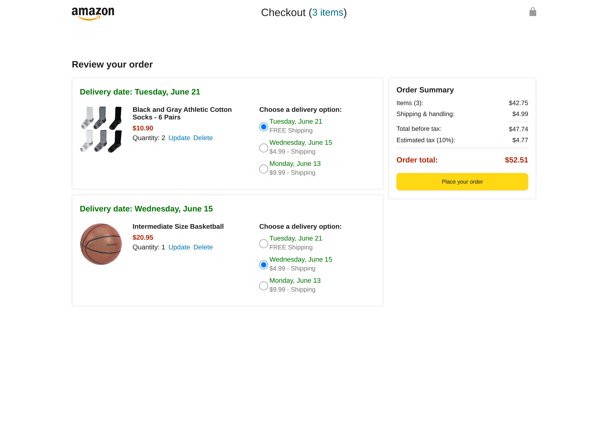
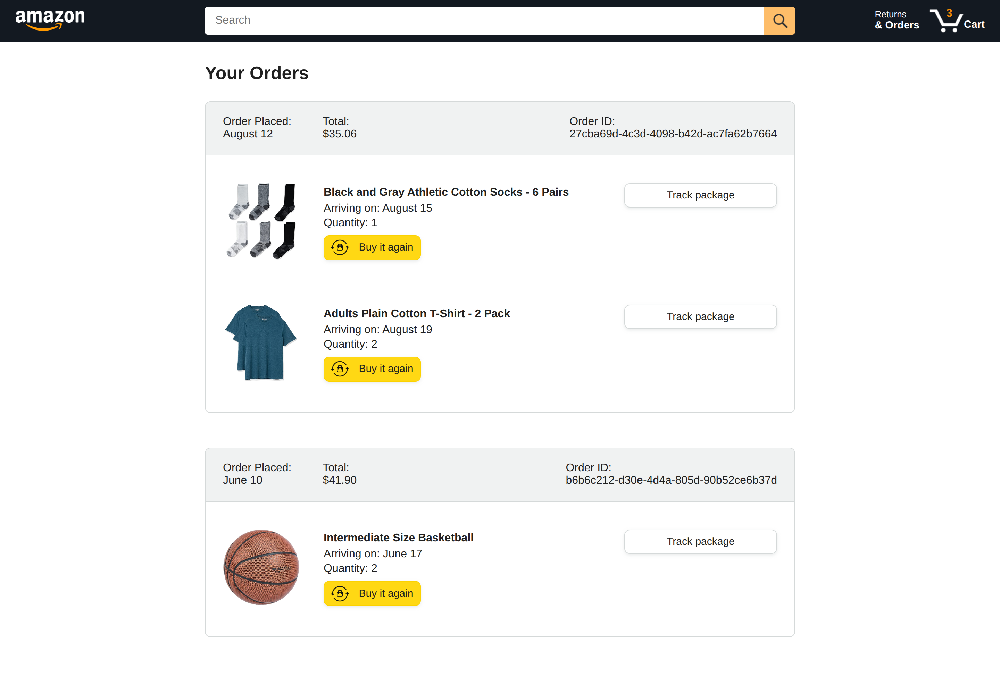

# Amazon Storefront Clone

A front-end clone of the Amazon storefront, built with plain HTML, CSS and JavaScript while learning how a multi-page e-commerce flow fits together. Products, cart state and orders are all handled client-side.

> **Educational project.** This is a personal learning exercise and is not affiliated with, endorsed by, or connected to Amazon in any way. Product data and imagery are course sample assets used for practice only.



## Pages

| Page | What it does |
|---|---|
| `index.html` | Product grid with ratings, prices, quantity select and add-to-cart |
| `checkout.html` | Cart review, quantity updates, delivery options and order summary |
| `orders.html` | Past orders with per-item status |
| `tracking.html` | Delivery progress for a single item |

### Checkout



### Orders



## Features

- Product catalogue rendered from a JavaScript data module
- Add to cart with quantity selection, cart badge updates live
- Cart persistence across pages
- Delivery option selection with different dates and prices
- Order summary with subtotal, shipping, tax and total
- Order history and a delivery tracking view

## Tech

| Part | Used |
|---|---|
| Structure | HTML5 |
| Styling | CSS3, custom properties, flexbox and grid |
| Logic | Vanilla JavaScript (ES modules) |
| Data | Local JS/JSON product and cart modules |

## Running it

The pages use ES modules, so they need to be served over HTTP rather than opened directly from the file system:

```bash
git clone https://github.com/3mora-A/amazon.git
cd amazon
python3 -m http.server 8000
```

Then open `http://localhost:8000`.

## Project structure

```
index.html        checkout.html      orders.html      tracking.html
data/             # product catalogue and cart state
scripts/          # page logic
styles/           # shared and per-page stylesheets
backend/          # static products.json
images/           # product and UI imagery
screenshots/      # previews used in this README
```

## Notes

Built in November 2024 as a front-end practice project. The focus was DOM rendering from data, managing shared cart state across pages, and laying out a realistic multi-page interface with CSS.
